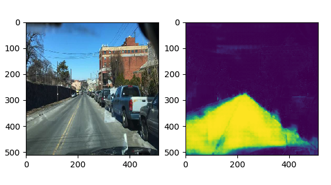

# tf-segmentation-trainer

Template for training image segmentation networks in TensorFlow. The code is structured for swapping out different segmentation architectures. Currently a `UnetModel` class (with improvements on the original paper) is provided. Other model architectures can easily be added and trained in the same framework.

## Setup

If you use virtual environments, create a new virtual environment, and then with it activated:

```
pip install -r requirements.txt
```

### Data
Each image file and corresponding mask should have the same basename regardless of extension. Images are expected as three-channel, RGB, `.jpg` files and masks are expected as num-class-channel `.png` files. These extensions can be modified in `train.py`.

## Usage

```
python train.py -i /data/images/ -m /data/masks/
```

For args descriptions run:

```
python train.py --help
```

Sample prediction for road segmentation task:

